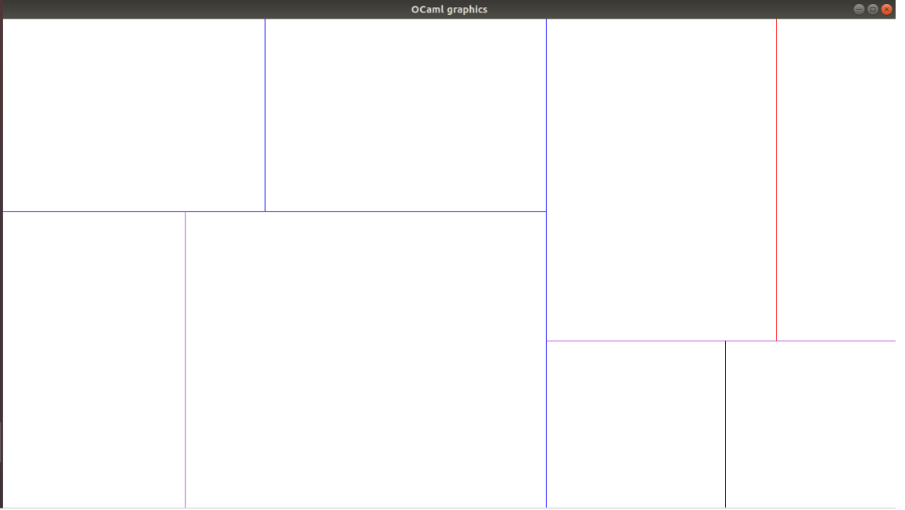
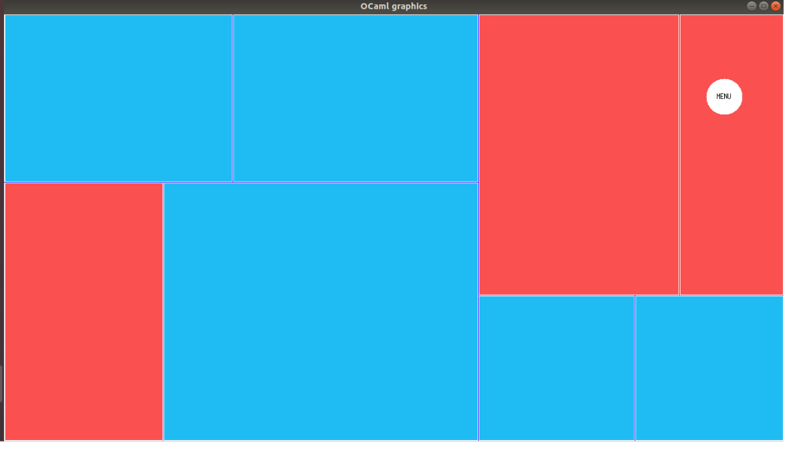

Projet Programmation Fonctionnelle - Jeu de Puzzle
=================================

Omar Aldakar - Yuchen Bai

Jeu de puzzle en Ocaml  (pour vous aider à compléter le puzzle appuyez sur h). Le principe est de colorier les rectangles de façon à ce que la couleur corresponde à la couleur du bord, si le bord est violet le carré peut être de n'importe quelle couleur. 

La particularité de ce projet c'est que l'on résoud ,au moyen d'un SAT solver, un problème de NP complexe sur de petites instances dans un langage complètement fonctionnel. 
 
- Installer ocaml "sudo apt install ocaml"
- Puis exécuter ./compile.sh dans le dossier ou ce trouve ce README

## Images

## Contributeurs 
 
- Yuchen Bai
- Omar Aldakar
